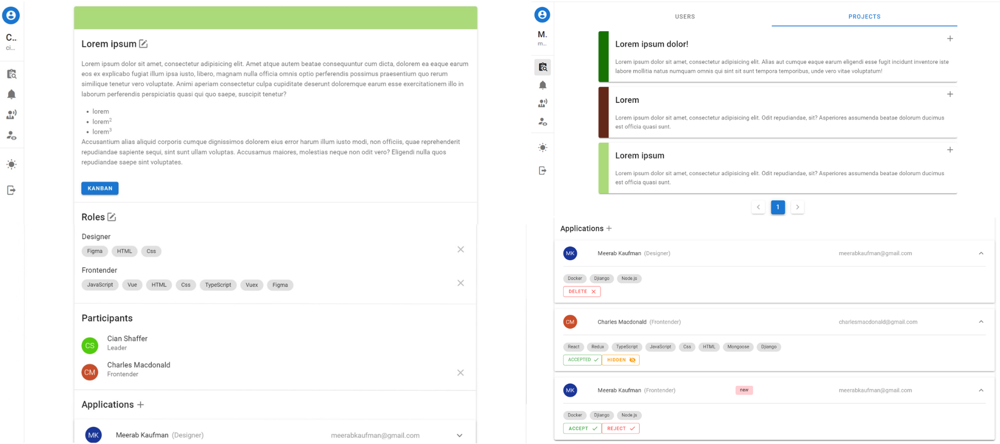
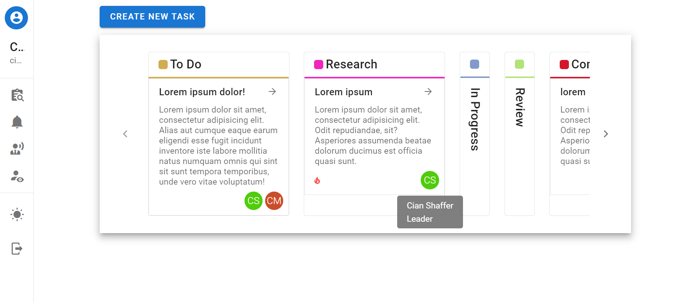
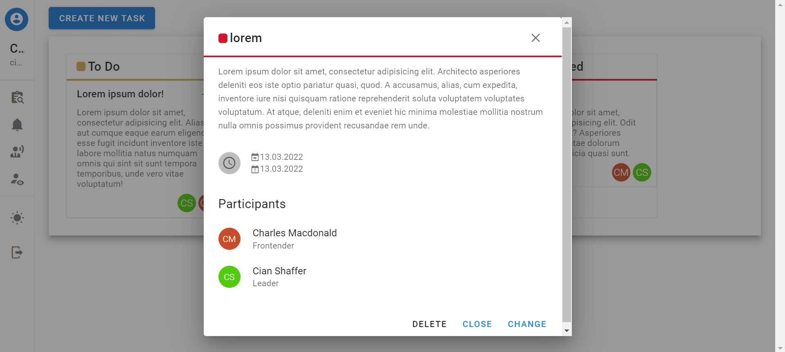
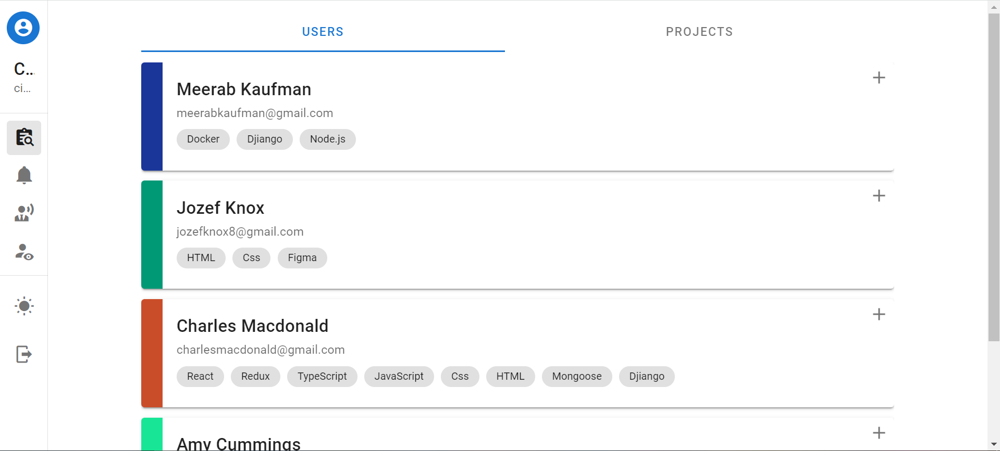
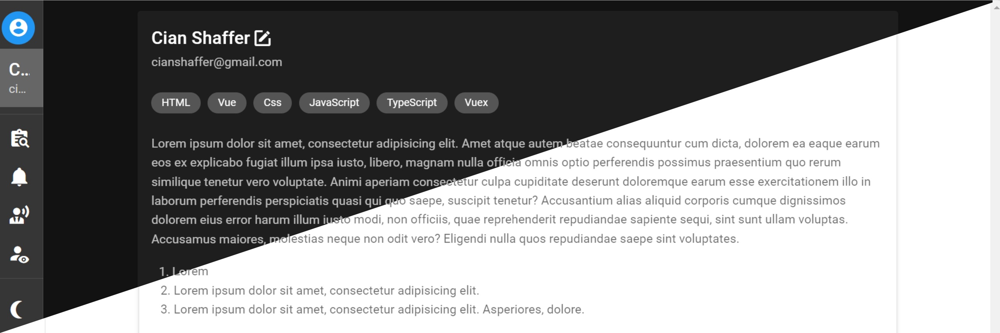

<!-- PROJECT LOGO -->
 

  <h3 align="center">Project Control</h3>
  

    📝📅 App for creating projects, finding participants  and controlling tasks using a kanban board
  

<!-- TABLE OF CONTENTS -->

  
Table of Contents

  <ol>
    <li><a href="#features">Features</a></li>
    <li><a href="#built-with">Built With</a></li>
  </ol>

 

<!-- FEATURES -->
<h2 id="features">✨ Features</h2>

* authorization, registration, profile change
* creating a project, adding roles to the project, searching for participants for these roles (applications from people or from the creator)
* beautiful kanban board for a project, adding and changing tasks, changing the status by task participant or project creator, marking burning tasks
* view (some with pagination)
  * all projects with the ability to join it 
  * all users with the ability to add them to your projects 
  * your applications 
  * projects in which you are a member
* dark and light themes
* icons for users by the first letters of the name with a unique color

#### Projects and applications

#### Kanban

#### Users

(<a href="#top">back to top</a>)

<!-- BUILT WITH -->
<h2 id="built-with">🏗️ Built With</h2>

* Node.js
* MongoDB
* Express
***
* Vue
* Vuex
* Vuex-smart-module
* Vue-router
* Vue-moment
* Axios
* Vuetify
* Vue2-editor

(<a href="#top">back to top</a>)

